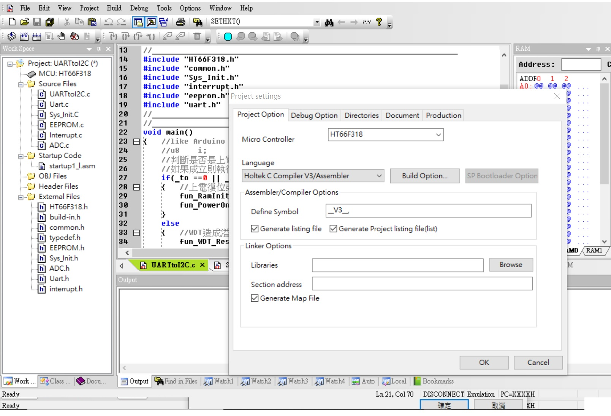

## UARTtoI2Cwith8bitsMCU
* HT-IDE3000 V7.99  HT66V317/HT66V318 28ssop
* Used HT66V318 control LED matrix, EEPROM, ADC, I2C ... via UART(can use RS-485)
* 專業便宜又好用, 不過案例竟然這樣的少, 太可憐! 看不下去! 

* HT-IDE3000 V7.99

* HOLTEK C Compiler V3/Assembly

#### Internal function HOLTEK 8bit MCU HT66V318:
* 利用Holtek MCU HT66F318 28sop 作為UART與EEPROM(內置)或其他GPIO...轉換工具
* Converter between UART w EEPROM (internal). 
* Converter between UART w LED matrix.
* Converter between UART w ADC (10bit).

#### Other:
* UART to control I2C with EEPROM external(24C02...)
* UART to control I2C with ADC external(HY3118 24bit ADC)
