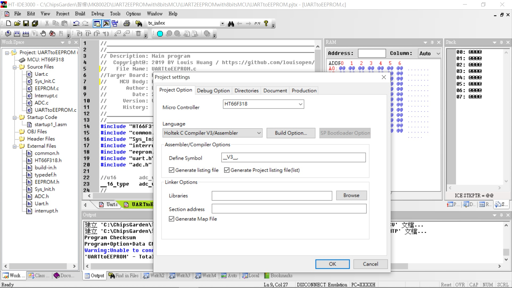
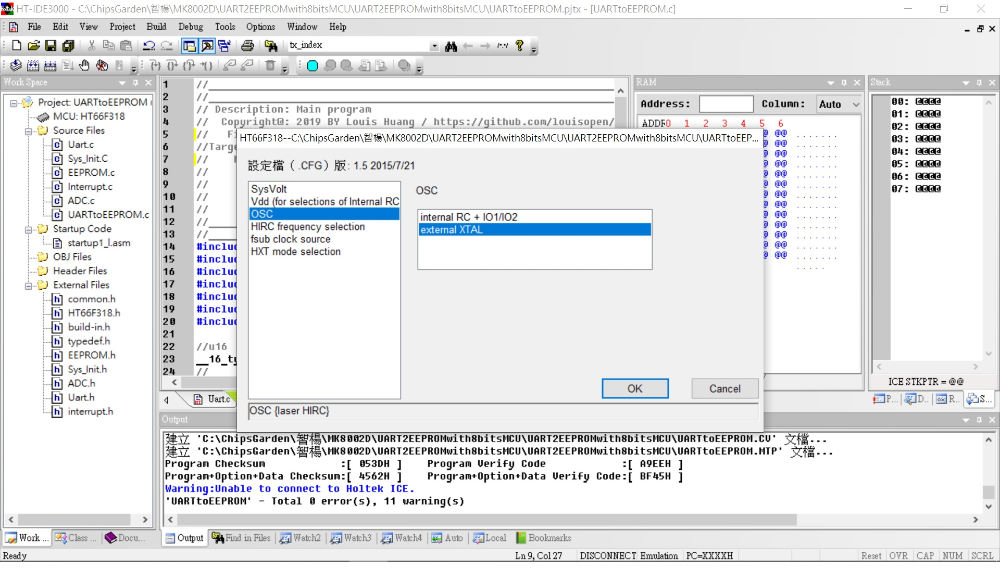
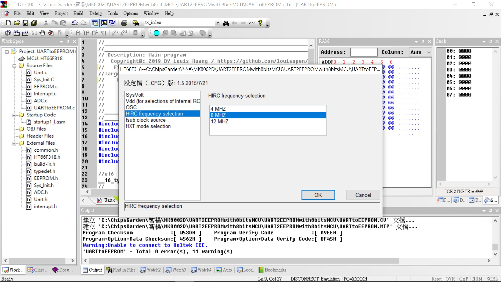
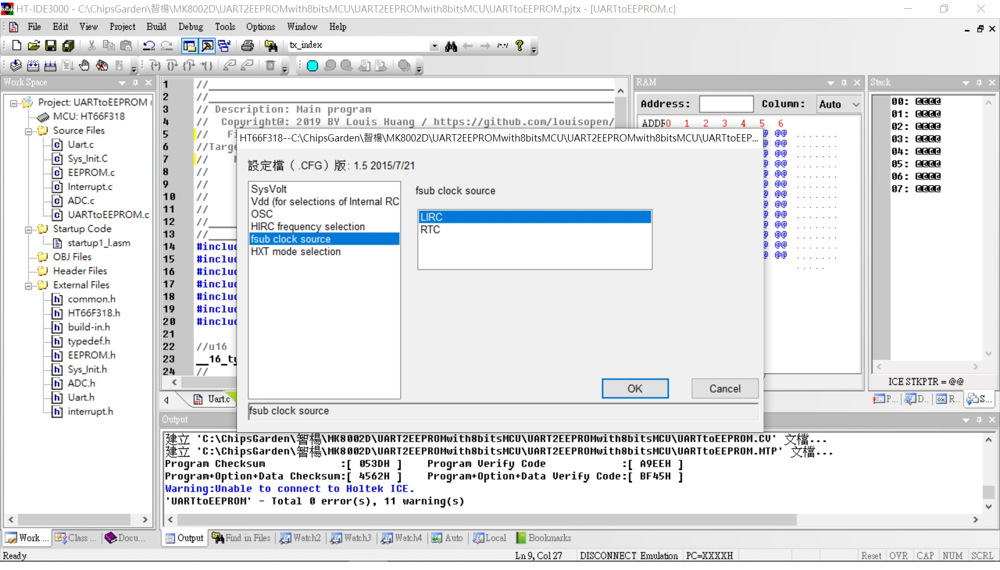
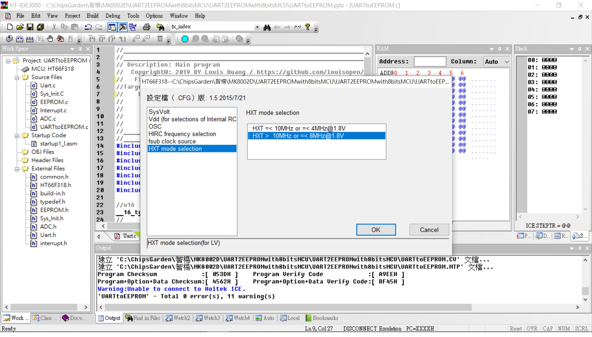
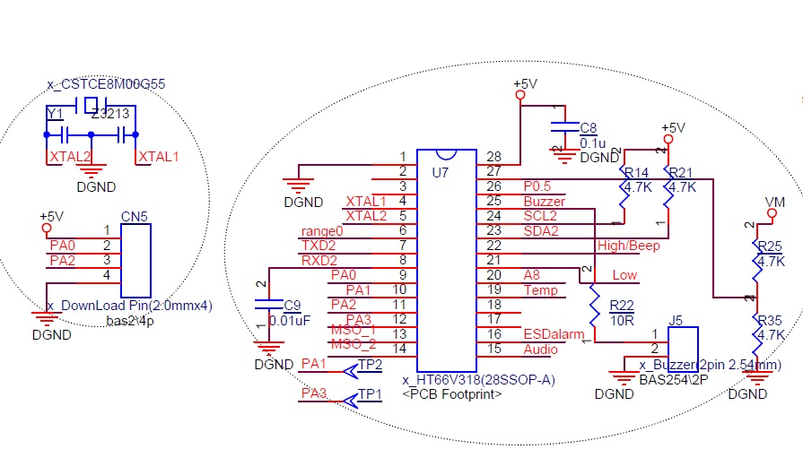

## ※UARTtoEEPROMwith8bitsMCU
* Used HT66F318 control GPIO, LED matrix, EEPROM, ADC, I2C... via UART(Same with RS-485)
* 利用Holtek MCU HT66F318 28sop UART做為與EEPROM(內置)或其他GPIO的溝通途徑...開工必備工具
* 專業便宜又好用, 不過案例竟然這樣的少, 太可憐! 看不下去! 
* 首開範列是一個簡單利用PC軟件下達指令存取MCU內部的EEPROM(64byte), 但MCU內存緩衝故意弄小, 協議比照RS-485通訊協議格式. 8bit MCU 資源有限有許多限制慢慢挖掘吧!

* Project Option: 
HXT (External 8MHz X'tal): 可選項有:HXT(400K~16Mhz),HIRC4M,HIRC8M,HIRC12M 
LICR (Low speed internal RC for TB0/TB1): 可選項有:LXT(32.768Khz),LIRC(32Khz) 
WatchDog: enable 

* UART Baudrate: 9600,n,8,1 (協議格式參照RS-485通訊協議格式) 

* TB0,1 enable LIRC interrupt for 0.514sec, 0.514sec 

* HT-IDE3000 HT66F317/HT66F318 28ssop with HT-IDE3000 & e-Link & e-WriterPro 
文件[HT66F318 Document](https://www.holtek.com.tw/search?key=ht66F318) 
模擬&除錯Development & Debug[IDE3000 & ICE](https://www.holtek.com.tw/web/guest/ice) 
燒入器Progrmming & writer[HOPE3000 & e-WriterPro](https://www.holtek.com.tw/web/guest/programmer) 

### Relevant information
* HT-IDE3000 V7.99

* HOLTEK C Compiler V3/Assembly

* HT66F318 Config

* HT66F318 28ssop Schematic Diagram

### How to test it
* PC通訊軟件做為主動工具, 協議(9600,n,8,1), 格式比照RS-485格式 (PC指令CRC用 A0 0A代替, MCU反饋的為CRC-16)
* For Example: 
* UART Formate(Get from MCU): 44 03 00 00 00 04 A0 0A   #讀取EEPROM位址0x0000,4組(共計8個bytes)
MCU return設計最大每次讀取四組(8byte) 反饋如: 44 03 08 00 01 02 03 04 05 06 07 CRC CRC

* UART Formate(Write to MCU): 44 06 00 0A EE FF A0 0A   #寫入EEPROM位址0x000A,資料為0xEEFF
MCU return: 44 06 00 0A EE FF CRC CRC

### Other
* UART access to ADC internal 10 bits resolution.
* UART access to ADC converter(HY3118 24bit ADC) via I2C bus.
* UART access to OLED 16x2 driver via SPI bus.

